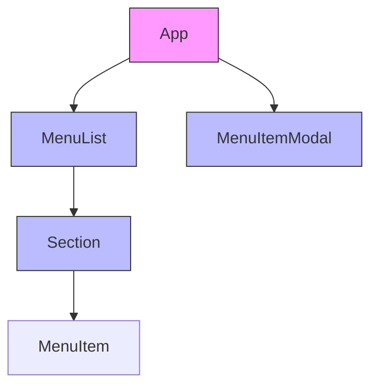
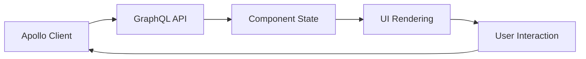

# Frontend Architecture Documentation

## Overview

### Component Structure



```mermaid
sequenceDiagram
    participant U as User
    participant C as Component
    participant A as Apollo
    participant G as GraphQL API
    
    U->>C: Select Item
    C->>A: Request Data
    A->>G: Query
    G->>A: Response
    A->>C: Update UI
    C->>U: Show Updated View
 ```

## Key Components
### MenuList
- Primary container component
- Manages item selected for modal display
- Implements responsive grid using Tailwind CSS


### MenuItemModal
- Manages item detail view
- Implements Framer Motion animations
- TODO: Handles modifier group selections
- Responsive layout for mobile/desktop
- Manages modal state and transitions

### State Management
- Apollo Client for GraphQL state
- Local component state for UI interactions


## Future Improvements
- Implement proper image CDN
- Add error boundary components
- Implement proper caching strategy 
- Handles image loading and fallbacks
  - lazily load images
  - fallback images
  - loading spinner for images
- Add accessibility features
  - lighthouse highlighted color contrast
  - add aria-labels